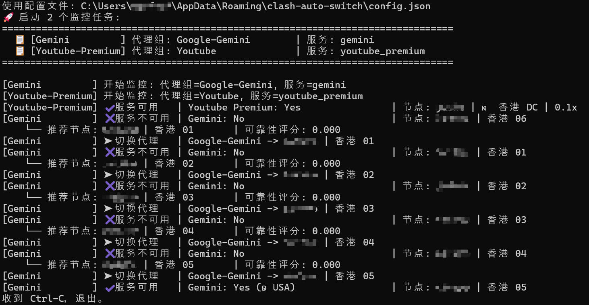
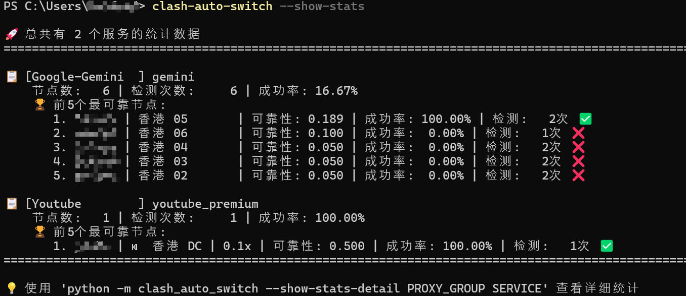

### 项目简介

`clash_auto_switch` 是自动切换Clash节点，以保证目标服务（如 ChatGPT、Netflix、Disney+ 等）可用的小工具。



- 程序会定时检测服务，未解锁/不可用时自动切到下一个可用节点
- 节点在指定的proxy-group中选择

### 使用说明
- 对于用户指定的一对(`proxy-group`, `service`)，本工具会在`proxy-group`中切换节点，以保证`service`可用

- 简易用法
  - 不修改clash的配置/订阅
  - `proxy-group`:配置为默认代理组(包含你的所有节点)
  - `service`: 选择要监控的服务
  - 示例配置
    ```json
    "tasks": [
      {
          "proxy_group_name": "your default proxy group",
          "service_name": "chatgpt",
          "enabled": true
      }
    ]
    ```

- 高级用法
  - 为每一个要监控的`service`，在Clash中单独配置一个`proxy-group`
  - 示例配置
    ```json
    "tasks": [
      {
          "proxy_group_name": "openai_proxy_group",
          "service_name": "chatgpt",
          "enabled": true
      },
      {
          "proxy_group_name": "gemini_proxy_group",
          "service_name": "gemini",
          "enabled": true
      }
    ]
    ```

### 安装

```bash
# 源码安装
pip install .
```

或者直接下载二进制版 [release](https://github.com/manfred-exz/clash_auto_switch/releases/latest)

### 运行

本工具完全基于配置文件模式，可以同时监控多个代理组和服务：

#### 基本使用流程

1. 生成配置文件模板：
```bash
clash_auto_switch --generate-config
```

2. 查看配置文件位置和内容：
```bash
clash_auto_switch --show-config
```

3. 根据需要编辑配置文件（见下方配置说明）

4. 运行监控：
```bash
# 使用配置文件中的设置运行（默认持续监控）
clash_auto_switch

# 只运行一次，服务可用后退出
clash_auto_switch --once
```

#### 查看统计信息

查看所有服务的统计信息概览：
```bash
clash_auto_switch --show-stats
```



查看特定代理组和服务的详细节点统计：
```bash
clash_auto_switch --show-stats-detail "YourGroup" "netflix"
```

按 Ctrl-C 可以随时退出。

### 配置文件说明

配置文件自动保存在与节点历史数据相同的位置（跨平台标准数据目录），采用 JSON 格式，包含以下部分：

```json
{
  "clash": {
    "controller": "127.0.0.1:9097",
    "secret": null,
    "http_proxy": "http://127.0.0.1:7890"
  },
  "monitoring": {
    "interval_sec": 30.0,
    "max_rotations": 0
  },
  "tasks": [
    {
      "proxy_group_name": "🇺🇸美国",
      "service_name": "chatgpt",
      "enabled": true
    },
    {
      "proxy_group_name": "🇭🇰香港",
      "service_name": "netflix",
      "enabled": true
    }
  ]
}
```

配置选项说明：
- `clash.controller`：Clash External Controller 地址
- `clash.secret`：Clash API 密钥（如未设置则为 null）
- `clash.http_proxy`：探测请求所走的 HTTP 代理地址
- `monitoring.interval_sec`：检测间隔（秒）
- `monitoring.max_rotations`：最大连续切换次数（0 表示无限制）
- `monitoring.once`：是否只运行一次（false 表示持续监控，true 表示服务可用后退出）
- `tasks`：监控任务列表
  - `name`：任务名称（用于日志区分）
  - `proxy_group_name`：Clash 代理组名称
  - `service_name`：服务名称
  - `enabled`：是否启用该任务

### 命令行参数

- `--generate-config`：生成配置文件模板到默认位置
- `--show-config`：显示当前配置文件位置和内容  
- `--once`：只运行一次，服务可用后退出（覆盖配置文件设置）
- `--show-stats`：显示所有有数据的服务统计信息概览并退出
- `--show-stats-detail PROXY_GROUP SERVICE`：显示指定代理组和服务的详细节点统计并退出
- `--clear-stats`：清除所有节点统计信息

**默认行为**：程序默认进入持续监控模式，会一直运行直到手动停止。

所有其他配置（Clash地址、代理端口、检测间隔等）都通过配置文件管理。

### 支持的服务与别名

以下名称大小写不敏感：

- ChatGPT：`chatgpt`, `openai`
- Netflix：`netflix`
- Disney+：`disney+`, `disney`, `disney_plus`
- Prime Video：`prime_video`, `prime`, `amazon_prime`
- Gemini：`gemini`
- YouTube Premium：`youtube_premium`, `youtube`
- 哔哩哔哩大陆：`bilibili_mainland`, `bilibili_cn`
- 哔哩哔哩港澳台：`bilibili_hk_mc_tw`, `bilibili_hk`
- 动画疯：`bahamut_anime`, `bahamut`


### Clash配置参考
配置proxy-groups

- 包括所有节点

  ```yaml
  -   name: "Google-Gemini"
      type: select
      include-all-proxies: true
  ```

- 可以手动挑选节点，如

  ```yaml
  -   name: "Google-Gemini"
      type: select
      proxies:
          - node-a
          - node-b
          - node-c
  ```

- 使用proxy-providers

  ```yaml
  -   name: "Google-Gemini"
      type: select
      use:
          - provider-a
  ```

配置路由规则rules

- 使用[geosite](https://github.com/v2fly/domain-list-community)
  ```yaml
  - GEOSITE,google-gemini,Google-Gemini
  - GEOSITE,youtube,Youtube
  ```

- 手动配置请参考 https://wiki.metacubex.one/config/rules/


### 常见问题

- 提示无法连接或 401：
  - 确认 `--controller` 地址正确且 Clash 已运行；
  - 若 Clash 设置了 `secret`，必须通过 `--secret` 传入；
  - 某些实现需要 `http://` 协议前缀，尝试 `--controller http://127.0.0.1:9097`。


### 其他

服务检测代码基于[clash-verge-rev](https://github.com/clash-verge-rev/clash-verge-rev). 
