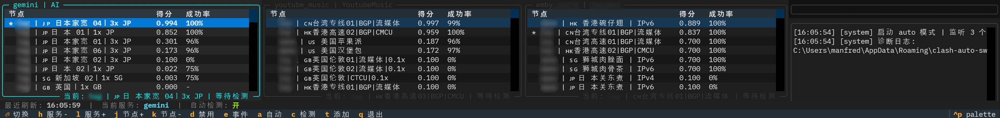
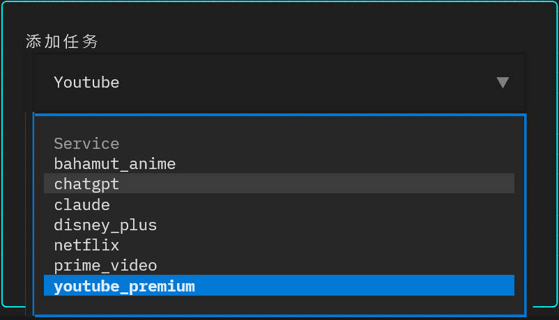

# clash-auto-switch

`clash-auto-switch` 是一个基于 Clash API 的服务可用性监控和自动切换工具。它会在指定 ProxyGroup 内切换节点，确保目标服务可用。

*适合当你的节点不能稳定的访问目标服务时*

适合这些场景：

- YouTube Music、ChatGPT、Gemini、Claude 等服务在部分节点不可用
- 节点可连通但服务解锁状态不稳定
- 希望在终端 TUI 中查看每个服务的节点得分、成功率和当前节点

实现原理：

如当你配置了YoutubeMusic(Clash ProxyGroup)和youtube_music(`clash-auto-switch`支持的service)后，`clash-auto-switch` 会：

- 监控 Clash 实时连接日志
- 发现 youtube_music 服务的连接
  - 触发服务可用性检查
  - 若不可用，自动切换到下一个节点
  - 循环


## Quickstart

### 1. 安装&启动

```bash
uv tool install git+https://github.com/manfred-exz/clash_auto_switch/
clash-auto-switch
```

不安装使用：
```bash
uvx --from git+https://github.com/manfred-exz/clash_auto_switch/ clash-auto-switch
```



### 2. 初始化配置

- Clash 需要开启 External Controller。
- 根据提示填入Clash的`controller`地址/`secret`/`http_proxy`地址
- 进入TUI界面后，按`t`添加你需要监控的服务

    

## TUI 快捷键

运行后会进入基于 Textual 的动态刷新终端界面：

- `h` / `l`: 切换服务列
- `j` / `k`: 选择节点
- `Enter`: 手动切换到选中节点
- `d`: 禁用/取消禁用选中节点
- `e`: 最大化/恢复事件窗口；最大化后可滚动查看历史事件
- `a`: 在 auto 模式中开启/关闭当前服务连接触发的自动检测与自动切换
- `c`: 手动触发当前服务检测
- `t`: 添加一个新的 `(ProxyGroup, service)` 任务并写入配置
- `q`: 退出

节点列表字段：

- 节点: Clash 节点名；`*` 表示当前 ProxyGroup 正在使用的节点
- 得分: 历史可靠性评分
- 成功率: 历史检测成功率

服务检测前会先通过当前节点访问 `https://cp.cloudflare.com/generate_204` 做基础连通性检查。若该检查失败，会直接跳过当前节点并尝试切换到下一个候选。

## 配置说明

### `clash`

```json
{
  "controller": "127.0.0.1:9097",
  "secret": null,
  "http_proxy": "http://127.0.0.1:7890"
}
```

- `controller`: Clash External Controller 地址。
- `secret`: Clash API 密钥。未设置时使用 `null`。
- `http_proxy`: 服务检测请求使用的 HTTP 代理地址。

### `tasks`

```json
{
  "proxy_group_name": "Youtube",
  "service_name": "youtube_music",
  "enabled": true
}
```

- `proxy_group_name`: Clash ProxyGroup 名称。
- `service_name`: 服务检测名称。
- `enabled`: 是否启用。

## 支持的服务

当前默认启用检测：

- `chatgpt`
- `claude`
- `gemini`
- `youtube_premium`
- `youtube_music`
- `bahamut_anime`
- `netflix`
- `disney_plus`
- `prime_video`


## Clash 配置参考

ProxyGroup 示例：

```yaml
proxy-groups:
  - name: "Youtube"
    type: select
    include-all-proxies: true

  - name: "AI"
    type: select
    proxies:
      - node-a
      - node-b
      - node-c
```

规则示例：

```yaml
rules:
  - GEOSITE,youtube,Youtube
  - DOMAIN-SUFFIX,music.youtube.com,Youtube
  - DOMAIN-SUFFIX,gemini.google.com,AI
  - MATCH,Proxy
```

更多规则格式参考 MetaCubeX 文档：

https://wiki.metacubex.one/config/rules/

## 开发文档

开发和架构说明见：

[docs/development.md](./docs/development.md)

## 说明

服务检测实现参考了 clash-verge-rev 的解锁检测思路：

https://github.com/clash-verge-rev/clash-verge-rev
